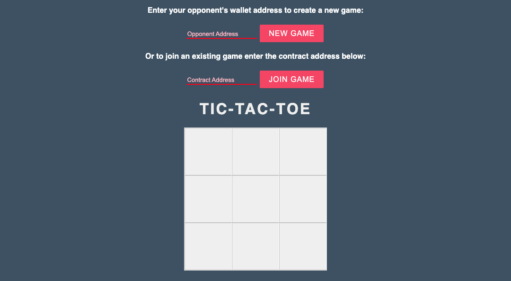

# Decentralized Tic-Tac-Toe

A decentralised tic tac toe game built with Solidity.

## System Dependencies

- Git
- Docker

## Project Setup

### Setup

1. Build the tic-tac-toe docker image.
`docker build -t tic-tac-toe .`

### Run development

1. Start the ganache test chain

`docker run -p 8545:8545 -d trufflesuite/ganache-cli:latest -g 0`

2. Start the web server

`docker run -p 8080:8080 -d tic-tac-toe`

3. Open `http://localhost:8080/` in two separate web browsers with each a separate Metamask installed, and enjoy the game. On Chrome you can create **two different users** and install Metamask in each. You'll need to configure Metamask to connect to your local chain as well (which is not graded but we leave this up to you as part of the exercise for your own testing).

### Run tests

`docker run tic-tac-toe npm test`
